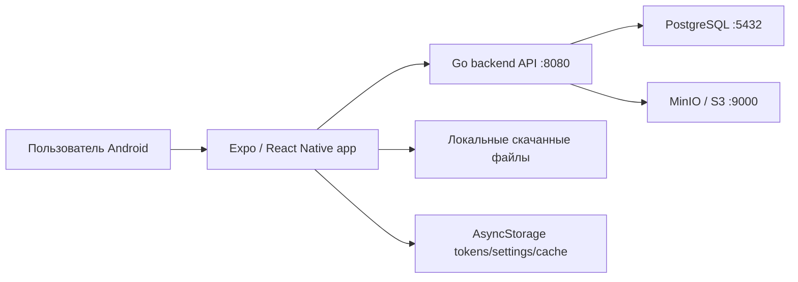
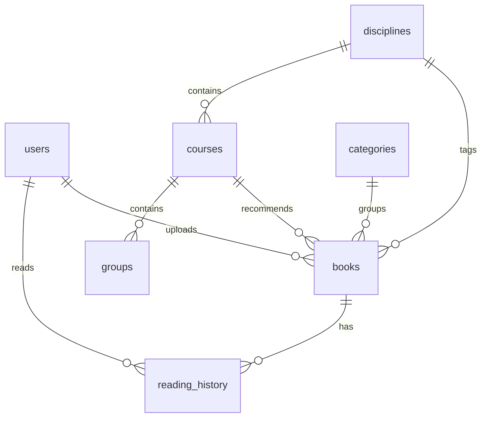

# PocketLib Documentation

Дата актуализации: 11 июня 2026.

PocketLib - мобильная библиотечная система для колледжа. Проект состоит из React Native/Expo клиента, Go backend, PostgreSQL базы данных и MinIO/S3 хранилища файлов. EPUB/PDF/TXT чтение остается на стороне клиента, а пользователи, группы, дисциплины, книги, файлы книг и прогресс чтения централизованы через backend.

## Содержание

1. [Краткое описание](#краткое-описание)
2. [Быстрый запуск](#быстрый-запуск)
3. [Структура проекта](#структура-проекта)
4. [Архитектура](#архитектура)
5. [Frontend: React Native приложение](#frontend-react-native-приложение)
6. [Backend: Go API](#backend-go-api)
7. [База данных](#база-данных)
8. [Файлы книг и загрузка](#файлы-книг-и-загрузка)
9. [EPUB/PDF/TXT reader](#epubpdftxt-reader)
10. [Локализация](#локализация)
11. [Справочники колледжа](#справочники-колледжа)
12. [Роли и права доступа](#роли-и-права-доступа)
13. [API endpoints](#api-endpoints)
14. [APK build](#apk-build)
15. [Проверка и тестирование](#проверка-и-тестирование)
16. [Troubleshooting](#troubleshooting)
17. [Что уже реализовано](#что-уже-реализовано)
18. [Что можно улучшить дальше](#что-можно-улучшить-дальше)

## Краткое описание

PocketLib решает задачу учебной электронной библиотеки:

- студент выбирает свою группу при регистрации;
- преподаватель или админ загружает учебный материал;
- книга хранится на сервере, а не сразу на телефоне;
- студент скачивает файл только по кнопке **Скачать книгу**;
- скачанный файл открывается локально в reader;
- EPUB отображается с сохранением HTML/CSS/картинок;
- PDF открывается как оригинальный документ;
- прогресс чтения, закладки и настройки ридера синхронизируются с backend;
- группы, курсы, дисциплины и локализация хранятся в PostgreSQL.

Главная идея архитектуры: **централизованные данные на сервере, чтение и визуальный reader на клиенте**.

## Быстрый запуск

### Требования

Нужно установить:

- Node.js;
- npm;
- Docker Desktop;
- Expo/EAS через `npx`;
- Android устройство или эмулятор;
- для backend без Docker локально нужен Go 1.24, но обычный запуск идет через Docker.

### Установка зависимостей

```powershell
npm install
```

### Запуск всей системы для разработки

```powershell
npm run dev:pocketlib
```

Команда делает следующее:

- запускает backend через Docker Compose;
- поднимает PostgreSQL;
- поднимает MinIO;
- собирает и запускает Go API;
- ждет `GET /health`;
- выставляет `EXPO_PUBLIC_API_URL`;
- запускает Expo в LAN-режиме.

### Ручной запуск backend

```powershell
npm run backend:up:detached
```

или с логами в консоли:

```powershell
npm run backend:up
```

Проверка backend:

```powershell
Invoke-RestMethod http://localhost:8080/health
```

Остановка backend:

```powershell
npm run backend:down
```

### Запуск Expo отдельно

```powershell
$env:EXPO_PUBLIC_API_URL="http://192.168.1.10:8080"
npx expo start --lan -c
```

Для телефона нельзя использовать `localhost`, потому что телефон будет искать backend внутри себя. Нужен LAN IP компьютера или адрес реального сервера.

### Стартовый администратор

```text
Email:    admin@university.edu
Password: admin123
```

## Структура проекта

```text
pocketlib-rn/
  app/                         Expo Router screens
  assets/                      иконки, изображения, splash
  components/                  переиспользуемые UI-компоненты
  constants/                   тема и legacy/local constants
  contexts/                    AuthContext, LanguageContext
  services/                    клиентские API/service слои
  utils/                       helper-функции
  scripts/                     PowerShell запуск и APK builder
  Backend/
    backend/                   Go backend
      cmd/server/              entrypoint API
      src/app/                 сборка приложения, schema, seed
      src/config/              env/config
      src/domain/              domain-модели
      src/http/                HTTP handlers/routes
      src/repo/                PostgreSQL repositories
      src/servisec/            business services
      src/sqlc/                legacy/reference sqlc файлы
    services-up/               Docker Compose stack
    mobile/                    старая копия mobile, не активная
```

Активное мобильное приложение находится в корне проекта: `app`, `services`, `contexts`, `components`.

Папка `Backend/mobile` является старой копией и не используется текущим TypeScript проектом. Она исключена из активной разработки.

## Архитектура



### Почему так сделано

- Backend нужен, чтобы база была централизованной, а не локальной у каждого телефона.
- PostgreSQL выбран как основная серверная БД для пользователей, групп, дисциплин, книг и прогресса.
- MinIO выбран как локальная S3-совместимая система хранения файлов книг.
- React Native/Expo выбран для быстрой Android-разработки и сборки APK.
- EPUB reader оставлен на клиенте, потому что отображение EPUB требует WebView, локальных файлов и интерактивной настройки чтения.
- Книги не скачиваются автоматически: файл появляется на телефоне только после нажатия кнопки **Скачать книгу**.

## Frontend: React Native приложение

### Основные технологии

- `react-native 0.81.5`
- `expo ~54.0.33`
- `expo-router ~6.0.23`
- `react-native-paper ^5.15.1`
- `react-native-webview 13.15.0`
- `expo-file-system`
- `expo-document-picker`
- `expo-intent-launcher`
- `@react-native-async-storage/async-storage`
- `jszip`
- `fast-xml-parser`
- `typescript`

### `app/_layout.tsx`

Корневой layout. Подключает:

- `AuthProvider`;
- `LanguageProvider`;
- Stack routes;
- auth redirect logic.

Сейчас корневой layout больше не обязан инициализировать локальную SQLite как основную БД. Данные берутся с backend.

### `app/(tabs)/_layout.tsx`

Нижняя навигация:

- Главная;
- Библиотека;
- Добавить;
- Админ;
- Справочники;
- Профиль.

Старая вкладка official/eGov скрыта и удалена из активной навигации.

### `app/(tabs)/index.tsx`

Главная страница студента/преподавателя:

- приветствие;
- статистика;
- быстрые действия;
- рекомендации по группе/курсу/дисциплине;
- последние материалы.

### `app/(tabs)/library.tsx`

Каталог материалов:

- поиск;
- фильтр "только офлайн";
- фильтр по дисциплине;
- фильтр по категории;
- фильтр по типу материала;
- открытие карточки книги.

### `app/(tabs)/add.tsx`

Добавление учебного материала:

- выбор PDF/TXT/EPUB;
- ввод названия, автора, описания;
- выбор типа материала;
- выбор языка;
- выбор дисциплины;
- выбор курса;
- выбор категории;
- создание записи книги на backend;
- загрузка файла на backend.

Файл не становится "скачанным" у клиента после загрузки. Он хранится на сервере и будет скачан на устройство только через карточку книги.

### `app/book/[id].tsx`

Карточка книги:

- показывает метаданные;
- показывает статус файла: офлайн или на сервере;
- показывает дисциплину, курс, источник;
- показывает прогресс чтения;
- дает кнопку **Скачать книгу**, если файл есть на сервере, но не скачан локально;
- дает кнопку **Читать**, если файл уже скачан;
- позволяет преподавателю/админу назначить дисциплину.

### `app/reader/[id].tsx`

Reader:

- текстовый режим;
- EPUB WebView режим;
- EPUB text fallback;
- media/document режим для PDF/DJVU;
- темы;
- размер шрифта;
- line-height;
- ширина страницы;
- закладки;
- серверная синхронизация прогресса.

### `app/(tabs)/settings.tsx`

Справочники:

- дисциплины;
- курсы;
- группы;
- коды;
- `name_kk`;
- `name_en`;
- год поступления группы.

Добавление дисциплин и курсов поддерживает локализованные поля, чтобы новые справочники нормально отображались на RU/KZ/EN.

### `app/(tabs)/admin.tsx`

Админка:

- просмотр пользователей;
- смена ролей;
- удаление пользователей;
- быстрый переход к добавлению книги.

### `app/auth/login.tsx` и `app/auth/register.tsx`

Авторизация:

- login через backend;
- register через backend;
- выбор группы при регистрации;
- сохранение access/refresh tokens в AsyncStorage.

## Клиентские сервисы

### `services/backendApi.ts`

Единая точка HTTP-запросов к backend:

- вычисляет `API_BASE_URL`;
- берет `EXPO_PUBLIC_API_URL`;
- fallback для Expo host;
- refresh token при `401`;
- сохраняет и очищает токены;
- формирует Authorization headers.

### `services/bookService.ts`

Работа с книгами:

- `getAllBooks`;
- `getBookById`;
- `addBook`;
- `uploadBookFile`;
- `downloadBookFile`;
- `updateBook`;
- `deleteBook`;
- `assignDiscipline`.

Также хранит локальную карту скачанных файлов в AsyncStorage. Это нужно, чтобы клиент знал, какие серверные файлы уже есть на устройстве.

### `services/disciplineService.ts`

Работа со справочниками:

- дисциплины;
- курсы;
- группы;
- категории;
- localized input для `code`, `name_kk`, `name_en`.

### `services/userService.ts`

Пользователи:

- login/register;
- current user;
- list users;
- update role;
- delete user.

### `services/readerService.ts`

Reader state:

- локальный прогресс;
- локальные закладки;
- локальные настройки reader;
- sync с backend по `book:<id>`;
- offline fallback.

Если backend недоступен, чтение продолжает работать локально. Следующее успешное сохранение снова отправит состояние на сервер.

### `services/epubService.ts`

EPUB parser:

- открывает EPUB как zip;
- читает `META-INF/container.xml`;
- читает OPF;
- строит manifest/spine;
- извлекает HTML/CSS/media во временную папку;
- определяет fixed-layout;
- готовит главы для WebView;
- умеет text fallback.

## Backend: Go API

Backend находится в `Backend/backend`.

### Основные технологии

- Go 1.24;
- стандартный `net/http`;
- PostgreSQL через `pgx/v5`;
- MinIO/S3 через AWS SDK;
- JWT access/refresh tokens;
- Docker Compose для локального запуска.

### Backend структура

```text
Backend/backend/
  cmd/server/             main()
  src/app/                Run(), schema, seed
  src/config/             env config
  src/domain/             domain structs/errors
  src/http/               handlers and routes
  src/repo/               PostgreSQL access
  src/servisec/           business logic services
```

Название папки `servisec` историческое. Сейчас именно там лежит service layer.

### `Backend/backend/src/app/app.go`

Собирает backend:

- создает logger;
- читает config;
- подключается к PostgreSQL;
- применяет schema;
- применяет seed catalog;
- подключает S3/MinIO;
- создает repos/services;
- запускает HTTP server.

### `Backend/backend/src/app/schema.go`

Содержит SQL schema bootstrap:

- расширение `pgcrypto`;
- таблицы;
- индексы;
- совместимость со старыми схемами;
- `ALTER TABLE IF NOT EXISTS` для мягких миграций.

Это не полноценная миграционная система, но для дипломного проекта и Docker-старта удобно: backend сам приводит БД к актуальному виду при запуске.

### `Backend/backend/src/app/catalog_seed.json`

Seed данных:

- группы колледжа;
- дисциплины;
- курсы;
- категории.

Backend применяет seed на старте. Поэтому при новом PostgreSQL контейнере справочники уже будут в базе.

### `Backend/backend/src/http`

HTTP layer:

- auth endpoints;
- user endpoints;
- catalog endpoints;
- book endpoints;
- file upload/download;
- reader progress endpoints.

### `Backend/backend/src/repo`

Repository layer. Здесь находится SQL-доступ к PostgreSQL:

- `auth.go`;
- `book.go`;
- `group.go`;
- `reader.go`.

### `Backend/backend/src/servisec`

Business logic:

- validation;
- token generation;
- S3 storage;
- catalog operations;
- book operations;
- reader sync.

## Docker stack

Docker Compose расположен здесь:

```text
Backend/services-up/docker-compose.yml
```

Сервисы:

- `postgres` - PostgreSQL 16;
- `minio` - S3-compatible file storage;
- `minio-init` - создает bucket `files`;
- `api` - Go backend.

Порты:

```text
API:           http://localhost:8080
PostgreSQL:    localhost:5432
MinIO API:     http://localhost:9000
MinIO console: http://localhost:9001
```

Dev credentials:

```text
Postgres DB:       pocketlib
Postgres user:     pocketlib
Postgres password: pocketlib
MinIO user:        minio
MinIO password:    miniosecret
Default admin:     admin@university.edu / admin123
```

## База данных

### Главные таблицы



### `users`

Пользователи.

Поля:

- `id`;
- `login`;
- `email`;
- `full_name`;
- `password`;
- `group_id`;
- `role`;
- `created_at`;
- `updated_at`.

Роли:

- `student`;
- `teacher`;
- `admin`.

### `disciplines`

Дисциплины и направления.

Поля:

- `id`;
- `name`;
- `code`;
- `name_kk`;
- `name_en`;
- `color`.

### `courses`

Курсы/квалификации внутри дисциплин.

Поля:

- `id`;
- `name`;
- `year`;
- `discipline_id`;
- `code`;
- `name_kk`;
- `name_en`.

### `groups`

Учебные группы.

Поля:

- `id`;
- `name`;
- `course_id`;
- `admission_year`.

### `categories`

Категории материалов.

### `books`

Книги и учебные материалы.

Ключевые поля:

- `title`;
- `author`;
- `description`;
- `source`;
- `discipline_id`;
- `course_id`;
- `category_id`;
- `material_type`;
- `language`;
- `semester`;
- `access_level`;
- `uploaded_by`;
- `content_s3_key`;
- `content_s3_bucket`;
- `file_name`;
- `file_size`;
- `content_type`.

Если `content_s3_key` и `content_s3_bucket` заполнены, backend отдает `has_file: true`.

### `reading_history`

Серверная история чтения.

Поля:

- `user_id`;
- `book_id`;
- `progress`;
- `page`;
- `total_pages`;
- `font_size`;
- `bookmarks` JSONB;
- `appearance` JSONB;
- `last_opened`.

На клиенте это синхронизируется через `services/readerService.ts`.

## Файлы книг и загрузка

### Поток загрузки преподавателем

1. Преподаватель выбирает файл в `app/(tabs)/add.tsx`.
2. Клиент вызывает `POST /books`.
3. Backend создает запись книги.
4. Клиент вызывает `POST /books/{id}/file`.
5. Backend сохраняет файл в MinIO.
6. Backend обновляет книгу: `content_s3_key`, `content_s3_bucket`, `file_name`, `file_size`, `content_type`.

### Поток скачивания студентом

1. Студент открывает карточку книги.
2. Если `has_file = true`, но локального файла нет, показывается кнопка **Скачать книгу**.
3. Клиент вызывает `GET /books/{id}/file`.
4. Файл сохраняется в локальную папку приложения.
5. В AsyncStorage сохраняется локальный путь файла.
6. Reader открывает локальный файл.

Такой подход экономит память телефона: клиент не хранит всю библиотеку, а скачивает только нужные материалы.

## EPUB/PDF/TXT reader

### TXT

TXT читается напрямую через `expo-file-system`, очищается и разбивается на страницы.

### EPUB

EPUB открывается через `services/epubService.ts`:

- zip parsing через `jszip`;
- OPF parsing через `fast-xml-parser`;
- chapter HTML отображается в `react-native-webview`;
- картинки, стили, таблицы и fixed-layout сохраняются лучше, чем при конвертации в plain text.

### PDF/DJVU

PDF и DJVU не конвертируются в текст. Они открываются как оригинальные документы через Android intent/external viewer, чтобы сохранить верстку, графики и таблицы.

### Reader settings

Настройки:

- тема;
- шрифт;
- размер текста;
- line-height;
- ширина страницы;
- bookmarks.

Они сохраняются локально и синхронизируются с backend.

## Локализация

Поддерживаемые языки:

- `ru`;
- `kk`;
- `en`.

### Где хранится UI-локализация

```text
contexts/LanguageContext.tsx
```

Там находится словарь интерфейсных ключей и `useLanguage()`.

### Где хранится локализация справочников

В PostgreSQL:

- `disciplines.name`, `disciplines.name_kk`, `disciplines.name_en`;
- `courses.name`, `courses.name_kk`, `courses.name_en`;
- joined fields у groups/courses.

### Где форматируются локализованные названия

```text
utils/localizedCatalog.ts
```

Функции:

- `getLocalizedDisciplineName`;
- `getLocalizedCourseName`;
- `formatStudentGroupDescription`.

Fallback:

- если выбран `kk`, но `name_kk` пустой, берется базовое `name`;
- если выбран `en`, но `name_en` пустой, берется базовое `name`;
- код дисциплины/курса добавляется перед названием.

## Справочники колледжа

### Источники

Справочники сформированы из:

- списка групп колледжа `stud-groups.json`;
- расписания `10.06.2026. 1-2 ауысым ОҢ апта.docx`;
- ручного добавления через админский экран справочников.

Runtime-приложение не зависит от файлов из `Downloads`. Данные перенесены в backend seed:

```text
Backend/backend/src/app/catalog_seed.json
```

### Группы

Группы хранятся в `groups` и привязаны к `courses`.

### Дисциплины

Обычные предметы и коды результата обучения `РО 5.1`, `РО 7.2` и похожие значения хранятся как дисциплины, потому что в расписании они используются как реальные учебные занятия.

### Почему official/eGov удален

Старая логика официальных книг и gov/eGov источников была убрана, потому что:

- она не нужна текущему сценарию колледжной библиотеки;
- ссылки не давали стабильного reader experience;
- фокус проекта теперь на backend-хранилище учебных материалов;
- интерфейс стал проще.

## Роли и права доступа

### Student

Может:

- регистрироваться;
- выбирать группу;
- смотреть библиотеку;
- скачивать доступные книги;
- читать скачанные файлы;
- иметь прогресс и закладки.

### Teacher

Может:

- добавлять книги;
- загружать файлы;
- назначать дисциплины;
- пользоваться справочниками.

### Admin

Может:

- все действия teacher;
- управлять пользователями;
- менять роли;
- удалять пользователей;
- управлять группами;
- управлять справочниками.

## API endpoints

Base URL в dev:

```text
http://localhost:8080
```

Для телефона:

```text
http://<LAN-IP-компьютера>:8080
```

### Health

```http
GET /health
```

### Auth

```http
POST /auth/register
POST /auth/login
POST /auth/refresh
POST /auth/logout
GET  /auth/me
```

### Users

Только admin:

```http
GET    /users
POST   /users
GET    /users/{id}
PUT    /users/{id}
DELETE /users/{id}
PATCH  /users/{id}/role
```

### Catalog

```http
GET    /disciplines
POST   /disciplines
DELETE /disciplines/{id}

GET    /courses
POST   /courses
DELETE /courses/{id}

GET    /categories
POST   /categories
DELETE /categories/{id}

GET    /groups
POST   /groups
GET    /groups/{id}
PUT    /groups/{id}
DELETE /groups/{id}
```

`GET` endpoints публичные, изменение справочников требует admin.

### Books

```http
GET    /books
POST   /books
GET    /books/{id}
PUT    /books/{id}
DELETE /books/{id}
POST   /books/{id}/file
GET    /books/{id}/file
GET    /books/{id}/file-url
```

Создание/редактирование/загрузка файла требует teacher/admin.

Скачивание файла требует авторизации.

### Reader progress

```http
GET /reader-progress/{book_id}
PUT /reader-progress/{book_id}
```

Требует авторизации.

Пример body:

```json
{
  "page": 4,
  "total_pages": 168,
  "font_size": 18,
  "bookmarks": [4, 12, 50],
  "appearance": {
    "font_family": "serif",
    "line_height": 1.7,
    "page_width": 760,
    "theme": "paper"
  }
}
```

## APK build

Подробная инструкция находится в `BUILD_APK.md`.

### Быстрая сборка

```powershell
npm run build:apk:easy
```

Скрипт:

- определяет LAN IP;
- выставляет `EXPO_PUBLIC_API_URL`;
- запускает TypeScript check;
- проверяет backend `/health`;
- запускает EAS build;
- скачивает artifact в `dist/apk`, если возможно.

### Dry run

```powershell
powershell -ExecutionPolicy Bypass -File scripts/build-apk.ps1 -DryRun -SkipTypecheck -SkipBackendCheck
```

### Важное правило

APK на телефоне не должен быть собран с `localhost` в `EXPO_PUBLIC_API_URL`.

Правильно:

```powershell
powershell -ExecutionPolicy Bypass -File scripts/build-apk.ps1 -ApiUrl "http://192.168.1.10:8080"
```

## Проверка и тестирование

### TypeScript

```powershell
npm run check
```

или:

```powershell
npx.cmd tsc --noEmit
```

### Backend Go tests через Docker

Если Go не установлен локально:

```powershell
docker run --rm -v "${PWD}\Backend\backend:/src/backend" -w /src/backend golang:1.24-bookworm go test ./...
```

### Docker Compose config

```powershell
docker compose -f Backend/services-up/docker-compose.yml config --quiet
```

### Backend health

```powershell
Invoke-RestMethod http://localhost:8080/health
```

### Проверка PowerShell builder

```powershell
powershell -ExecutionPolicy Bypass -File scripts/build-apk.ps1 -DryRun -SkipTypecheck -SkipBackendCheck
```

## Troubleshooting

### `docker` не распознан

Docker Desktop не установлен или не добавлен в PATH. Нужно установить Docker Desktop и открыть новое окно PowerShell.

### Docker есть, но daemon не работает

Ошибка похожа на:

```text
failed to connect to the docker API
```

Решение:

- запустить Docker Desktop;
- дождаться статуса Running;
- проверить:

```powershell
docker info
```

### WSL установлен, но Docker падает

После установки WSL нужен reboot Windows. Затем открыть Docker Desktop и убедиться, что включен Linux engine.

### TLS handshake timeout при pull images

Это сетевой timeout Docker Hub. Обычно помогает:

- повторить команду;
- проверить интернет;
- не закрывать Docker Desktop;
- дождаться скачивания образов.

### APK не видит backend

Почти всегда причина: APK собран с `localhost`.

Нужно собрать с LAN IP:

```powershell
powershell -ExecutionPolicy Bypass -File scripts/build-apk.ps1 -ApiUrl "http://192.168.1.10:8080"
```

Также нужно, чтобы телефон и компьютер были в одной сети.

### Backend health проходит на ПК, но телефон не подключается

Проверить:

- Windows Firewall;
- телефон и ПК в одной Wi-Fi сети;
- адрес `http://<LAN-IP>:8080/health` открывается с телефона в браузере;
- `android.usesCleartextTraffic` включен в `app.json`.

### EPUB выглядит плохо

Reader сейчас использует WebView для сохранения EPUB HTML/CSS. Если конкретный EPUB все равно отображается плохо:

- открыть оригинальный документ;
- попробовать текстовый fallback;
- проверить, fixed-layout это книга или reflowable;
- проверить, есть ли внутри EPUB нестандартные CSS/JS.

### Русский/Kazakh текст выглядит битым

Проверить, что файлы открыты как UTF-8. Локализация интерфейса хранится в `contexts/LanguageContext.tsx`, seed backend в `Backend/backend/src/app/catalog_seed.json`.

## Что уже реализовано

- Go backend;
- PostgreSQL schema bootstrap;
- MinIO/S3 file storage;
- Docker Compose stack;
- JWT auth;
- refresh token flow;
- роли `student`, `teacher`, `admin`;
- backend seed групп/дисциплин/курсов;
- централизованный каталог книг;
- upload/download файлов книг;
- локальное скачивание книг только по кнопке;
- EPUB reader через WebView;
- PDF original document flow;
- TXT reader;
- закладки;
- прогресс чтения;
- server sync прогресса/закладок/settings;
- локализация RU/KZ/EN;
- локализованные справочники;
- удобный APK builder;
- dev launcher `npm run dev:pocketlib`;
- удаление official/eGov вкладки из активной навигации.

## Что можно улучшить дальше

### 1. Полноценные миграции

Сейчас schema применяется через bootstrap SQL в `schema.go`. Для production лучше добавить миграции:

- goose;
- atlas;
- golang-migrate.

### 2. Валидация файлов

Добавить backend-проверку:

- MIME type;
- extension whitelist;
- maximum size;
- EPUB integrity;
- PDF integrity.

### 3. Полнотекстовый поиск

Добавить PostgreSQL full text search по:

- названию;
- автору;
- описанию;
- тегам;
- дисциплине;
- курсу.

### 4. Импорт расписания через админку

Сейчас расписание использовалось как источник для seed. Можно сделать UI:

- загрузить `.docx`;
- backend распарсил;
- показал preview;
- админ подтвердил;
- новые дисциплины попали в БД.

### 5. Улучшение reader

Можно добавить:

- thumbnails/оглавление EPUB;
- поиск по книге;
- highlights;
- заметки;
- server sync highlights;
- встроенный PDF viewer.

### 6. Production deploy

Для реального сервера нужно:

- HTTPS;
- домен;
- нормальные secrets;
- backup PostgreSQL;
- backup MinIO;
- закрытый bucket;
- reverse proxy.

### 7. Audit/security

Добавить:

- password reset;
- ограничение upload по ролям/дисциплинам;
- audit log действий админа;
- rate limiting auth endpoints.

## Основные команды

```powershell
npm install
npm run dev:pocketlib
npm run check
npm run backend:up:detached
npm run backend:down
npm run build:apk:easy
```

Backend check:

```powershell
Invoke-RestMethod http://localhost:8080/health
```

Go check через Docker:

```powershell
docker run --rm -v "${PWD}\Backend\backend:/src/backend" -w /src/backend golang:1.24-bookworm go test ./...
```
